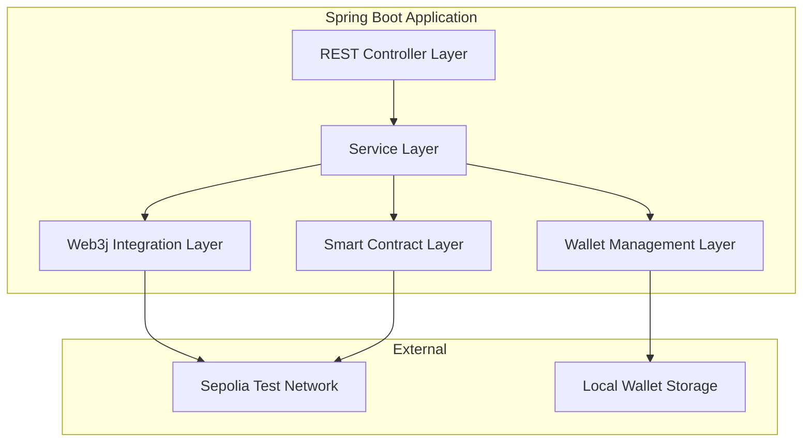

# 设计文档

## 概述

本项目是一个基于Spring Boot 3.x + Maven + Web3j 4.x的Java区块链学习平台。系统采用分层架构设计，通过RESTful API提供区块链交互功能，连接Sepolia测试网络进行智能合约部署和交易操作。项目重点关注代码的可读性和学习友好性，为Java开发者提供区块链技术的实践入门。

## 架构

### 系统架构图



### 技术栈

- **JDK版本**: Java 8
- **框架**: Spring Boot 2.7.x (兼容Java 8)
- **构建工具**: Maven 3.6.x
- **区块链库**: Web3j 4.9.x (兼容Java 8)
- **网络**: Sepolia Testnet via Infura
- **数据存储**: 本地文件系统（钱包）+ 内存缓存
- **API文档**: Springfox Swagger 3.x (兼容Java 8)
- **日志**: Logback + SLF4J

## 组件和接口

### 1. Controller层

#### BlockchainController
```java
@RestController
@RequestMapping("/api/blockchain")
public class BlockchainController {
    // 网络信息查询
    GET /network-info
    
    // 区块查询
    GET /blocks/latest
    GET /blocks/{blockNumber}
    
    // 交易查询
    GET /transactions/{txHash}
}
```

#### WalletController
```java
@RestController
@RequestMapping("/api/wallet")
public class WalletController {
    // 钱包管理
    POST /create
    POST /import
    GET /balance/{address}
    GET /info
}
```

#### ContractController
```java
@RestController
@RequestMapping("/api/contract")
public class ContractController {
    // 合约部署和交互
    POST /deploy
    POST /call
    GET /read/{contractAddress}/{methodName}
}
```

### 2. Service层

#### Web3Service
负责Web3j客户端管理和基础区块链操作
```java
@Service
public class Web3Service {
    - Web3j web3j
    - EthGasPrice gasPrice
    + getNetworkInfo(): NetworkInfo
    + getLatestBlock(): EthBlock
    + getBlockByNumber(BigInteger): EthBlock
    + getTransaction(String): Transaction
    + sendTransaction(RawTransaction): String
}
```

#### WalletService
处理钱包创建、导入和管理
```java
@Service
public class WalletService {
    - Credentials currentCredentials
    + createWallet(): WalletInfo
    + importWallet(String): WalletInfo
    + getBalance(String): BigInteger
    + getCurrentWallet(): WalletInfo
}
```

#### ContractService
智能合约部署和交互
```java
@Service
public class ContractService {
    + deploySimpleStorage(): ContractDeployResult
    + callContractMethod(String, String, Object[]): String
    + readContractMethod(String, String, Object[]): Object
}
```

### 3. 配置层

#### Web3Config
```java
@Configuration
public class Web3Config {
    @Value("${blockchain.infura.project-id}")
    private String infuraProjectId;
    
    @Value("${blockchain.network.name:sepolia}")
    private String networkName;
    
    @Bean
    public Web3j web3j() {
        String infuraUrl = String.format("https://%s.infura.io/v3/%s", networkName, infuraProjectId);
        return Web3j.build(new HttpService(infuraUrl));
    }
}
```

#### SecurityConfig
```java
@Configuration
public class SecurityConfig {
    // 基础安全配置
    // 私钥加密存储配置
}
```

## 数据模型

### 核心数据模型

#### WalletInfo
```java
public class WalletInfo {
    private String address;
    private BigInteger balance;
    private String balanceInEth;
    private LocalDateTime createdAt;
    // 注意：不包含私钥信息
}
```

#### NetworkInfo
```java
public class NetworkInfo {
    private String networkName;
    private BigInteger chainId;
    private BigInteger latestBlockNumber;
    private String nodeVersion;
    private boolean isConnected;
}
```

#### ContractDeployResult
```java
public class ContractDeployResult {
    private String contractAddress;
    private String transactionHash;
    private BigInteger gasUsed;
    private String status;
    private LocalDateTime deployedAt;
}
```

#### TransactionResult
```java
public class TransactionResult {
    private String transactionHash;
    private String status;
    private BigInteger gasUsed;
    private BigInteger gasPrice;
    private String blockHash;
    private BigInteger blockNumber;
}
```

### 智能合约模型

#### SimpleStorage合约
```solidity
pragma solidity ^0.8.0;

contract SimpleStorage {
    uint256 private storedData;
    
    event DataStored(uint256 data);
    
    function set(uint256 x) public {
        storedData = x;
        emit DataStored(x);
    }
    
    function get() public view returns (uint256) {
        return storedData;
    }
}
```

## 错误处理

### 异常层次结构

```java
// 基础异常
public class BlockchainException extends RuntimeException

// 具体异常类型
public class WalletException extends BlockchainException
public class ContractException extends BlockchainException  
public class NetworkException extends BlockchainException
public class TransactionException extends BlockchainException
```

### 全局异常处理器

```java
@ControllerAdvice
public class GlobalExceptionHandler {
    @ExceptionHandler(WalletException.class)
    public ResponseEntity<ErrorResponse> handleWalletException(WalletException e)
    
    @ExceptionHandler(ContractException.class) 
    public ResponseEntity<ErrorResponse> handleContractException(ContractException e)
    
    @ExceptionHandler(NetworkException.class)
    public ResponseEntity<ErrorResponse> handleNetworkException(NetworkException e)
}
```

### 错误响应格式

```java
public class ErrorResponse {
    private String error;
    private String message;
    private String timestamp;
    private String path;
    private int status;
}
```

## 测试策略

### 单元测试

- **Service层测试**: 使用Mockito模拟Web3j调用
- **Controller层测试**: 使用MockMvc进行API测试
- **工具类测试**: 测试钱包生成、地址验证等工具方法

### 集成测试

- **网络连接测试**: 验证与Sepolia测试网的连接
- **合约部署测试**: 在测试网上部署和验证合约
- **端到端测试**: 完整的钱包创建到合约交互流程

### 测试配置

```yaml
# application-test.yml
blockchain:
  infura:
    project-id: "test-project-id"
  network:
    name: "sepolia"
    chain-id: 11155111
  wallet:
    storage-path: "./test-wallets"
```

### Mock策略

- 使用WireMock模拟区块链网络响应
- 创建测试专用的智能合约
- 使用TestContainers进行集成测试环境

## 安全考虑

### 私钥管理

- 私钥使用AES加密存储在本地文件
- 支持环境变量配置私钥
- 内存中的私钥使用后立即清理
- 日志中绝不记录私钥信息

### API安全

- 实现基础的请求频率限制
- 输入参数验证和清理
- 敏感操作需要额外确认

### 网络安全

- 使用HTTPS连接区块链节点
- 验证SSL证书
- 实现连接超时和重试机制

## 配置管理

### 应用配置文件

```yaml
# application.yml
blockchain:
  infura:
    project-id: "${INFURA_PROJECT_ID:your-infura-project-id}"
  network:
    name: "sepolia"
    chain-id: 11155111
    display-name: "Sepolia Testnet"
  
  wallet:
    storage-path: "${WALLET_STORAGE_PATH:./wallets}"
    encryption-key: "${WALLET_ENCRYPTION_KEY:default-key}"
  
  contract:
    gas-limit: 4700000
    gas-price: 20000000000

logging:
  level:
    org.web3j: INFO
    com.yourpackage: DEBUG
```

### Maven依赖配置

```xml
<properties>
    <java.version>1.8</java.version>
    <spring-boot.version>2.7.18</spring-boot.version>
    <web3j.version>4.9.8</web3j.version>
</properties>

<dependencies>
    <!-- Spring Boot Starters -->
    <dependency>
        <groupId>org.springframework.boot</groupId>
        <artifactId>spring-boot-starter-web</artifactId>
    </dependency>
    
    <!-- Web3j Core -->
    <dependency>
        <groupId>org.web3j</groupId>
        <artifactId>core</artifactId>
        <version>${web3j.version}</version>
    </dependency>
    
    <!-- API Documentation (Java 8 compatible) -->
    <dependency>
        <groupId>io.springfox</groupId>
        <artifactId>springfox-boot-starter</artifactId>
        <version>3.0.0</version>
    </dependency>
    
    <!-- Test Dependencies -->
    <dependency>
        <groupId>org.springframework.boot</groupId>
        <artifactId>spring-boot-starter-test</artifactId>
        <scope>test</scope>
    </dependency>
</dependencies>
```